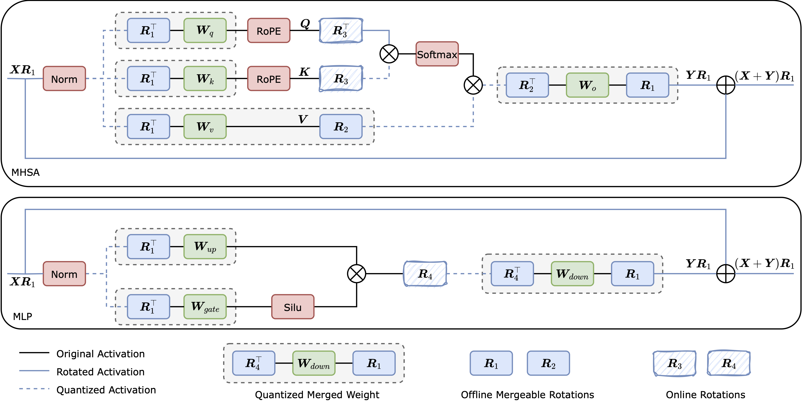

# RoSTE: An Efficient Quantization-Aware Supervised Fine-Tuning Approach for Large Language Model

This repository contains the code of RoSTE introduced in our work: ["RoSTE: An Efficient Quantization-Aware Supervised Fine-Tuning Approach for Large Language Models"](https://arxiv.org/abs/2502.09003)

## Installation

install environment
```bash
git clone https://github.com/quanwei0/RoSTE
cd RoSTE

conda create -n roste python==3.10 -y
conda activate roste
pip install -r requirements.txt
```
install the Fast Hadamard Transform package
```bash
git clone https://github.com/Dao-AILab/fast-hadamard-transform
cd fast-hadamard-transform
pip install .
```

## Usage

We provide the details of **TL;DR summarization** experiments for the Pythia and Qwen models.

Dataset: [TL;DR](https://huggingface.co/datasets/trl-lib/tldr)

Models:
- [Pythia 1B](https://huggingface.co/EleutherAI/pythia-1b-deduped), [Pythia 6.9B](https://huggingface.co/EleutherAI/pythia-6.9b-deduped)
- [Qwen2.5 0.5B](https://huggingface.co/Qwen/Qwen2.5-0.5B), [Qwen2.5 7B](https://huggingface.co/Qwen/Qwen2.5-7B)


### Pre-Processing (optional)

To keep computational invariance when using rotation, we need to transform Pythia models to Llama/Qwen-type model architecture. More specifically, we modify the Q, K, and V linear layers of the MHSA module in Pythia. 	The transformed Pythia models are also compatible with [QuaRot](https://github.com/spcl/QuaRot) and [SpinQuant](https://github.com/facebookresearch/SpinQuant).

```bash
python convert_pythia_to_llama_format.py --legacy_model_dir EleutherAI/pythia-1b-deduped --new_model_dir ./save/pythia-1b/ckpt/pythia-1b-deduped-new
```


### Optimal Rotation Configuration Search



We keep R1 as offline mergeable rotation and R2, R3, R4 as online rotations during training. Before inference, R2 can be merged into weights.

We first fuse norm (LayerNorm / RMSNorm) into weights and apply R1.

```bash
python rotate_model_r1.py --model_dir Qwen/Qwen2.5-0.5B --is_tldr_data --is_rotate_R1 --is_save --rotated_model_dir ./save/qwen2.5-0.5b/ckpts/qwen2.5-0.5b-r1
```

Then we compute the quantization error
```bash
python rotate_model_r234_quant_error.py --model_dir ./save/qwen2.5-0.5b/ckpt/qwen2.5-0.5b-r1 --output_folder ./rotation_config/qwen/
```

Next we search the optimal rotation configuration based on two quantization error logs.
```bash
python rotate_model_r234_search_config.py --output_folder ./rotation_config/qwen/
```


### Training

We provide three training methods: SFT, QA-SFT with STE, and QA-SFT with RoSTE.


SFT
```bash
accelerate launch \
    --config_file configs/ds_z3.yaml \
    train_sft.py \
    --config configs/recipes/qwen2.5_7b_sft.yaml
```

QA-SFT with STE
```bash
accelerate launch \
    --config_file configs/ds_z3.yaml \
    train_qa_sft_ste.py \
    --config configs/recipes/qwen2.5_7b_qa_sft_ste.yaml
```

QA-SFT with RoSTE
```bash
accelerate launch \
    --config_file configs/ds_z3.yaml \
    train_qa_sft_roste.py \
    --config configs/recipes/qwen2.5_7b_qa_sft_roste.yaml
```


### Evaluation

We evaluate the final models on the TL;DR test dataset, which supports multi-GPU inference.
```bash
accelerate launch eval_tldr.py --model_dir Qwen/Qwen2.5-0.5B --method base --batch_size 8
```


## Acknowledgement

Our code implementation is built upon open-source projects [TL;DR Summarization](https://github.com/vwxyzjn/summarize_from_feedback_details), [Tulu 3](https://github.com/allenai/open-instruct) and [Huggingface TRL](https://github.com/huggingface/trl). 
The implementation of rotation is based on [QuaRot](https://github.com/spcl/QuaRot) and [SpinQuant](https://github.com/facebookresearch/SpinQuant).
We sincerely appreciate the efforts of these teams for their contributions to open-source research and development. 

## Citation

If you find our work useful in your research please consider citing our paper:

```
@article{wei2025roste,
  title={RoSTE: An Efficient Quantization-Aware Supervised Fine-Tuning Approach for Large Language Models},
  author={Wei, Quan and Yau, Chung-Yiu and Wai, Hoi-To and Zhao, Katie Yang and Kang, Dongyeop and Park, Youngsuk and Hong, Mingyi and others},
  journal={arXiv preprint arXiv:2502.09003},
  year={2025}
}
```